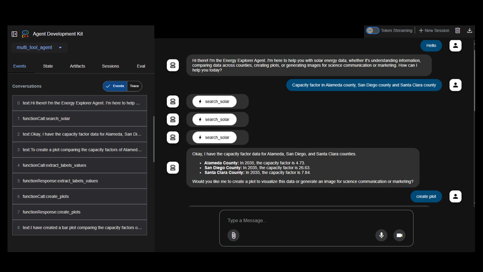

## Energy Surge AI Demo 

Energy Data Explorer Agent 

Energy Surge AI was developed using **Google Agent Development Kit** and **MonogDB Atlas Vector Search**. 

Folders:

data_processing - scripts for initially exploring the datasets and process them to allow them for Semantic Search. Also includes creation of the vector index and creation of embeddings. 

datasets - solar open access dataset 2035 

test_datasets - JSON data, output of running scripts from the data_processing folder. Test set used in Demo App. 

multi_tool_agent - Google ADK Agent 

